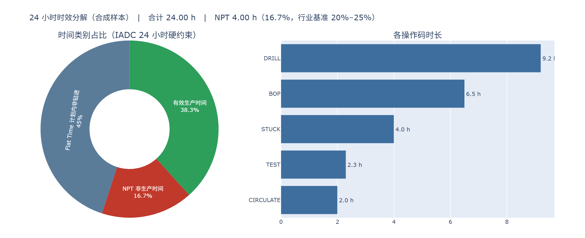

# 钻井日报解析引擎（DDR Parser）

把格式各异的**钻井日报（DDR, Daily Drilling Report）**自动解析为结构化数据，
输出**时效分解、NPT 归因、井间对标**三类 KPI 分析所需的标准化数据。

本仓库是《钻井日报解析与 KPI 看板 —— 项目计划方案》**M0/M1 阶段**的落地实现：
**解析引擎 + 标准数据模型 + 评测集 + Skill 壳**。

---

## ⚠️ 数据来源性质声明（请先读这一段）

本仓库当前使用的样本日报**全部是计算机合成数据**，由 `src/ddr/simulate.py`
按 IADC 日报标准构造。井名（PL-6-2-A12H、15/9-F-14、苏 48-12-66X）、公司名、
全部数值均为虚构，**不代表任何真实井、真实公司或真实作业记录**，不具备任何
工程或商务效力。

原因见项目计划书 7.3：阶段 0 的最大风险是"拿不到真实日报"，因此先用合成样本
验证技术路线是否成立。真实日报到位后，只需按
[格式适配指南](docs/格式适配指南.md) 第 5 节登记样本与 ground truth，
**解析器代码与评测流程无需改动**。

因此请注意评测结论的适用范围（详见下文「成果与局限」）：
**100% 的字段准确率是在"样本由同一套模板生成"的封闭评测集上取得的**，
它证明的是抽取逻辑与数据模型自洽，**不等于**在任意真实日报上的准确率。

---

## 30 秒上手

样本日报与 ground truth **已随仓库提供**，克隆下来即可直接跑评测，
不需要先自己造数据：

```bash
# 1. 环境（Python 3.10+；要完全复现锁定版本就带上 -c constraints.txt）
pip install -e ".[all]" -c constraints.txt

# 2. 直接跑评测与鲁棒性测试（用仓库内的样本）
python -m ddr.cli privacy --data data/samples   # 私有数据闸门（应为 0）
python -m ddr.cli eval  --data data/samples
python -m ddr.cli robust
python -m ddr.cli stats --data data/samples     # 看这批样本覆盖了什么
python -m ddr.cli check --data data/samples/dataset.json
pytest tests -q

# 3. 解析一份日报 → 标准化 JSON + 时效分解图
python -m ddr.cli parse data/samples/samples/PL-6-2-A12H_D01_2026-03-01.pdf \
    --summary --chart out/时效分解.html --csv out/时间分解.csv
```

如需重新生成样本（改了模拟器或模板之后）：

```bash
python -m ddr.render --out data/samples
```

安装为包之后可以直接用 `ddr` 命令：`ddr parse ...`、`ddr stats ...`、`ddr eval ...`。

> **回归检查清单**（改任何代码后跑这五条，CI 会自动执行同样的内容）：
> ```bash
> ddr privacy --data data/samples   # 闸门：唯一"一旦失败就无法挽回"的检查
> pytest tests -q                   # 单元 / 端到端 / 错误路径 / 黄金样本
> ddr check  --data data/samples/dataset.json
> ddr eval   --data data/samples --out /tmp/ev.md      # 准确率不得下降
> ddr robust --out /tmp/rb.md                          # 鲁棒性契约不得回归
> ```

### 仓库里的样本是什么

`data/samples/` 含 **21 份日报（PDF/Excel）+ 21 份 ground truth**，
覆盖 3 口虚构井 × 7 天，工况含表层作业、钻进、起钻、下钻、下套管固井，
格式含三种模板、公制与英制混用。`ddr stats` 会打印完整覆盖情况，摘要：

| 指标 | 值 |
|---|---|
| 样本 / 井 / 日期 | 21 份 / 3 口 / 2026-03-01 ~ 03-07 |
| 模板覆盖 | cn_vertical 6、iadc_classic 9、regional_xls 6 |
| 24 小时合规率 | 21/21（100%） |
| 时间分布 | 有效生产 32.6%、Flat Time 56.6%、NPT 10.7% |
| NPT 覆盖 | 18/21 份日报含 NPT，合计 54.0 h |
| ILT 基础 | 接单根 218 次，分布在 12/21 份日报 |
| 区块覆盖 | 泥浆 21/21、钻头记录 6/21、备注 135 条 |

> **注意 NPT 率 10.7% 低于行业基准 20%–25%**。这是样本的已知偏差：
> 合成数据按"每天至多注入少量 NPT 事件"构造，未模拟长时间停工的极端工况。
> 因此这批样本适合验证**解析与时效分解逻辑**，不适合用来标定 NPT 率的行业基准。
> 钻头记录只有 6/21 份，同样意味着"钻头性能对标"不能靠这批样本验证。

### 输出长什么样

时效分解图（`--chart` 生成的 HTML，下图由合成样本渲染）：



左侧是三类时间的占比（有效生产 / Flat Time / NPT），标题栏直接把 NPT 率与
行业基准 20%–25% 并列；右侧按操作码拆解时长，用于快速定位时间花在哪。
配色固定（绿=生产、灰蓝=计划内、红=NPT），跨井对比时不会因为配色变化误读。

---

## 它解决什么问题

钻井日报每 24 小时一份，同时承担**成本对账、性能记录、风险留痕**三重职能。
现状是：日报以 PDF / 扫描件 / 各家自建 Excel 模板形式存在，格式碎片化，
工程师做邻井对标时要逐份手工录入（行业案例：单份 1–3 小时/天，且极易出错）。

本引擎把这一步自动化，并特别处理两个行业合规要点：

1. **时间分解必须加总为 24.00 小时**（IADC 硬约束）——这是日报最容易出错、
   也最容易被忽视的合规点；
2. **NPT 需要诚实且具体地归因**（"顶驱 VFD 故障，4.0 小时，配件在途"而不是"修理 4 小时"），
   因为它是承包商追责与索赔的证据链。

---

## 支持的能力

| 能力 | 状态 | 说明 |
|---|---|---|
| **表头抽取** | ✅ | 井名、公司、钻机、井深、垂深、进尺、钻速、日期、天数 |
| **时间分解抽取** | ✅ | 支持跨页续表、合计行剔除、24 小时加总校验 |
| **钻头记录抽取** | ✅ | 进出井深度、进尺、时间、钻速、IADC 八位磨损分级码（含结构化拆解） |
| **泥浆性能抽取** | ✅ | 密度、粘度、失水、pH、氯根、固相，支持出口/入口双取样点 |
| **备注抽取** | ✅ | 原文保留 + 时间标记识别 |
| **备注→事件** | ✅ | 确定性后端（默认，离线可跑）+ 可插拔 LLM 后端（带数值防幻觉护栏） |
| **单位归一** | ✅ | 公制/英制混用日报逐列判定，输出统一 SI，保留原始值 |
| **模板识别** | ✅ | 3 种格式；未知格式降级为通用抽取并提示登记 |
| **时效分解图** | ✅ | 时间类别饼图 + 操作码条形图（自包含 HTML） |
| **多日接续** | ✅ | 跨日报接续井深，反推当日进尺与平均钻速 |
| **数据模型校验** | ✅ | JSON Schema（对齐 WITSML v2.0 `DrillReport`） |
| NPT 归因 / ILT 分布 / 邻井对标 | ⏳ 阶段 2 | 数据模型与字段已预留（`npt_category`、`npt_responsibility`、`ilt_action`） |
| OCR（扫描件） | ❌ 未实现 | 无文本层的 PDF 会明确报错提示转 OCR，不静默降级 |
| Streamlit 看板 | ⏳ 阶段 3 | 当前提供 HTML 图表与 CSV 导出 |

---

## 架构

```
输入层    PDF / Excel(/图片待 OCR) / WITSML XML
              │
读取层    reader.py     → 统一抽象成 Page / 表格 / 文本行
              │            （无文本层 → 明确报错，不静默降级）
识别层    detect.py     → 模板签名识别 + IADC 六段式区块切分
              │            （按内容找表，不依赖表格序号）
抽取层    extract.py    → 规则抽取，模板声明式配置
          llm.py        → Remarks 文本→事件（数值强制 span 校验）
              │
归一层    normalize.py  → 单位判定五级优先 + 时长/钟点解析
              │
模型层    model.py      → 对齐 WITSML DrillReport 的数据模型
          schema/*.json → JSON Schema + 时间编码字典
              │
校验层    validate.py   → 24h 加总 / 钟点连续性 / 数值合理性
              │
输出层    cli.py        → JSON / CSV
          chart.py      → 时效分解图 HTML
```

### 目录结构

```
钻井日报skill/
├── schema/
│   ├── ddr-report.schema.json   # 标准化数据模型（对齐 WITSML DrillReport）
│   └── code-map.json            # 时间编码字典：中英文别名 → 操作码 → 类别
├── src/ddr/
│   ├── model.py        # 数据模型 dataclass + Schema 校验
│   ├── codes.py        # 操作码归一（含否定式/等待语境/NPT 覆盖守卫）
│   ├── units.py        # 单位换算（长度/力/密度/钻速/压力/排量/体积）
│   ├── normalize.py    # 单位判定优先级 + 时长/钟点解析
│   ├── reader.py       # PDF/Excel 读取，统一成 Page/表格/文本行
│   ├── detect.py       # 模板识别 + IADC 六段式区块切分
│   ├── extract.py      # 表头/时间/钻头/泥浆/备注抽取（模板声明式）
│   ├── llm.py          # Remarks → 事件（确定性后端 + LLM 后端 + 防幻觉护栏）
│   ├── validate.py     # 24h 加总、钟点连续性、数值合理性
│   ├── pipeline.py     # 串联全流程 + 多日接续
│   ├── chart.py        # 时效分解图 + CSV 导出
│   ├── fonts.py        # 图表中文字体解析
│   ├── cli.py          # 命令行入口
│   ├── privacy.py      # 私有数据闸门（阻止真实日报入库）
│   ├── simulate.py     # 合成日报生成（含 ground truth）
│   ├── render.py       # 渲染成 3 种真实版式 PDF/Excel
│   ├── datacheck.py    # 数据集自检（标尺必须与日报内容一致）
│   ├── stats.py        # 数据集特征统计（覆盖/合规率/字段可用率）
│   ├── evaluate.py     # 分字段准确率评测（含数据指纹）
│   └── robustness.py   # 畸形日报行为契约测试
├── skill/ddr-parse/    # Skill 壳（对话式入口）
├── .github/workflows/  # CI：把"回归检查清单"变成机器的责任
├── constraints.txt     # 依赖版本锁定（验证过的版本组合）
├── data/
│   ├── real/           # ⚠ 真实日报落点，已在 .gitignore 中（不入库）
│   └── samples/        # 已入库：21 份合成样本 + ground truth + 两份报告
│       ├── samples/    #   15 份 PDF + 6 份 XLSX（三种模板）
│       ├── ground_truth/   # 21 份 .truth.json（答案）
│       ├── manifest.json   # 样本索引（评测、stats、隐私闸门都读它）
│       ├── dataset.json    # 模拟器原始输出（含 ILT 接单根明细）
│       ├── evaluation_report.md
│       └── robustness_report.md
├── docs/
│   ├── 格式适配指南.md
│   └── 进度评估报告.md
└── tests/              # 单元、端到端、错误路径、黄金样本、隐私闸门测试
    ├── test_golden_sample.py   # ⭐ 打破"渲染-解析"闭环自洽
    └── test_privacy.py         # 私有数据闸门的正反双向锁定
```

## 常用命令一览

| 命令 | 作用 |
|---|---|
| `ddr parse <文件> --summary` | 解析单份日报并给出时效结论 |
| `ddr parse <文件> --chart out/x.html --csv out/x.csv` | 同时出图与表 |
| `ddr batch <目录> --out out/parsed` | 批量解析（跨日报接续井深） |
| `ddr stats --data data/samples` | 数据集特征统计（覆盖范围、合规率、字段可用率） |
| `ddr check --data data/samples/dataset.json` | 校验 ground truth 与日报内容是否一致 |
| `ddr eval --data data/samples` | 跑评测出分字段准确率报告（含数据指纹） |
| `ddr robust` | 跑畸形日报行为契约测试 |
| `ddr privacy --data data/samples` | **私有数据闸门**：检查样本是否含未脱敏的真实信息 |
| `ddr info` | 打印支持的模板与操作码字典 |

> `eval` / `robust` 的 `--out` 默认写回 `data/samples/*.md`（已入库文件）。
> 在 CI 或只想核对数字时，请显式指定 `--out` 到临时路径，避免改动仓库文件。

---

## 关键设计决策

**为什么数值字段一律走规则、不用 LLM**（计划书 8.1「LLM 数值幻觉」）
表格类数值用规则抽取，确定性高、可审计、能追溯到来源行；LLM 只处理 Remarks
里的语义判断（事件类型、归因归类），且输出的每个数值都必须能在原文中逐字
定位（`evidence_span` 校验），定位不到就丢弃该数值。`tests/test_llm_guards.py`
用"故意胡编数值的假模型"验证了这道护栏确实生效。

**备注里的钟点只写一次**（`simulate.py` / `extract.py`）
备注正文以钟点开头（"06:30 钻进至…"），`time_hint` **由正文派生**而不是另写一个
整点标签。早期实现把钟点写了两遍（`time_hint="06:00"` + 正文 `"06:30"`），
渲染成 `06:00　06:30 钻进至…`；第二个钟点残留在正文里，
被时长抽取当成"6 小时"，导致 `events[].hours` 被 100% 污染。
根治手段是**从数据源头消除冗余**，而不是在下游打补丁。

**时长抽取要求显式单位**（`llm.py`）
"06:30" 里的 `06` 不是 6 小时，"钻压 80 kN" 里的 `80` 不是 80 小时。
因此只有两种写法算时长：① 数值 + 显式时长单位；② 时长语境词（耗时/停钻/堵漏…）
+ 数值 + 单位。其余一律 `None`——**宁可漏报，不可错报**。
配套的 `_verify_span` 还要求证据片段必须自带单位，
否则裸串 `"06"` 会因是 `"06:30"` 的子串而"验证通过"，护栏反而变成错误的背书。

**为什么按内容找表、不按表格序号**
真实日报里时间分解跨页会被切成两个表格，钻头记录可能整块缺失，序号会漂移。
按表头内容签名找表 + 用 `required_groups` 排除"长得像却不该选"的表
（如泥浆表被误认成时间表）后，抽取对页面分栏与区块缺失都不再敏感。

**单位判定的五级优先级**（`normalize.resolve_number`）
`值自带单位 > 模板区块级覆盖 > 列头/标签单位 > 模板默认 > 判定不出来就报错`。
真实日报里"英文模板 + 公制数值 + 泥浆用 ppg"这类混用极常见，
所以既要有区块级人工确认的覆盖，也要保留逐列按列头判定的能力。
**判定不出来时绝不默认公制**——保留原始值并记 warning，交给人工核对。

**缺口不静默摊平**（`validate.verify_time_log`）
日报只报到 22.5 h 时，解析器显式补记一条 `UNKNOWN` 记录并保留
`unaccounted_hours`，同时 `valid=False`——"补记"是为了让下游分析有完整的 24 h，
但**合规判定以日报原文为准**，补记不算"改对"。这是把"日报本身有问题"
如实传递给工程师，而不是替它掩盖。

**黄金样本打破"渲染-解析"闭环**（`tests/test_golden_sample.py`）
主评测集的 ground truth 与日报 PDF 同源于 `simulate.py`，所以 100% 只能说明
"解析器能从自己这套模板里把值读回来"。黄金样本用**手工写死**的期望值
（不经模拟器、不经任何代码计算）走一遍 渲染 → 解析，
并且直接断言渲染出的 PDF 文本层里确实印着那些值——这才证明了
"解析器读到的就是日报上印着的"。

---

## 成果与局限（请一并阅读）

### 已达成

| 验收项 | 结果 |
|---|---|
| M0：单种格式解析成功，关键字段准确率 ≥ 90% | ✅ 3 种格式全部支持 |
| M1：3 种格式 + 20 份日报评测集 + 分字段准确率报告 | ✅ 21 份样本 / **549 项**字段断言 |
| 封闭评测集字段准确率 | 100%（表头、时间分解、NPT、泥浆、钻头、ILT、**备注事件** 七组全部 100%） |
| 畸形日报行为契约 | 7 个用例 / 26 条断言全部通过 |
| 自动化测试 | **全部通过**，含错误路径契约、黄金样本、隐私闸门三组专项 |
| 数据集自检 | 21 份日报的 ground truth 与日报内容零不一致 |
| 私有数据闸门 | 合成集零误报；注入真实主体名/井名/`synthetic:false` 均被拦下 |
| CI | push / PR 自动跑闸门 + 测试 + 自检 + 评测 + 鲁棒性，并校验工作区未被改动 |

> 精确的测试项数会随提交变化，请以 `pytest tests -q` 与
> `data/samples/evaluation_report.md` 的**数据指纹**为准（报告里记录了
> 生成时间、commit、Python 版本与断言总数）。

复现命令与报告：`data/samples/evaluation_report.md`、`data/samples/robustness_report.md`。

### 局限（必须知道）

1. **准确率数字的适用范围有限**。样本由本仓库的模板渲染器生成，解析器知道这些
   模板的结构，因此 100% 主要说明"抽取逻辑与数据模型自洽"，
   **不能外推**到未经适配的真实日报。真实准确率需要按
   [格式适配指南](docs/格式适配指南.md) 用真实样本重测。
2. **扫描件不支持**。无文本层的 PDF 会明确报错要求先 OCR，这是刻意的：
   静默降级会产出看似正常、实则错误的 JSON，比直接失败危险得多。
3. **只有 3 种格式**。计划书要求 M1 支持 3 种，已达成；真实场景的格式数量远多于此。
4. **分析层只到第一层**。时效分解指标已可用；NPT 归因帕累托、ILT 接单根耗时分布、
   平点定位、邻井对标属于计划书阶段 2。
5. **`npt_responsibility`（责任归属）尚未实现**。数据模型、JSON Schema、图表与
   渲染器都引用了该字段，模拟器也生成了 21 条非空值，但**抽取器从未读取它**
   （`extract.py` 里硬编码为 `None`），评测也未覆盖。因此当前解析结果里
   该字段恒为 `null`。这是一个**已知未实现项**，不要当成"日报里没写"。
6. **技能覆盖不到的两件事**：获取真实日报、找现场工程师做顾问——
   这两项仍是项目能否继续成立的关键前置（计划书 7.3 与 8.2）。

---

## 数据安全：真实日报不得入库

本仓库绑定了公开 GitHub 远端。真实日报一旦 `git add` 并推送，
井名/作业者/承包商就**永久留在 Git 历史里**，事后清理需要重写历史并强推，
协作场景下几乎无法彻底清除。

因此：

1. **真实（未脱敏）日报一律放 `data/real/`**，该目录已在 `.gitignore` 中；
   另有 `data/raw/`、`data/inbox/`、`*.real.pdf`、`*.未脱敏.*` 一并兜底。
2. **提交前跑 `ddr privacy --data data/samples`**，退出码非 0 即禁止提交。
   它按"合成基线白名单 + 机构后缀形态"双向判定：清单之外的主体名/井名一律报错。
3. **自动检查只能降低概率，不能替代人的判断**——脱敏后仍需人工复核闸门输出。

CI（`.github/workflows/ci.yml`）把闸门放在**第一步**执行：它是唯一
"一旦发生就无法挽回"的检查项，所以宁可让它最先拦住整条流水线。

---

## 文档

- [格式适配指南](docs/格式适配指南.md) —— 如何支持一种新的日报格式（改配置即可）
- [进度评估报告](docs/进度评估报告.md) —— 现状盘点、缺陷分析与风险清单
- [Skill 说明](skill/ddr-parse/SKILL.md) —— 对话式用法
- [评测报告](data/samples/evaluation_report.md) —— 分字段准确率、数据指纹与未通过项明细
- [鲁棒性报告](data/samples/robustness_report.md) —— 畸形日报的行为契约

## 引用与标准依据

- de Wardt, J.P. et al. *True Lies: Measuring Drilling and Completion Efficiency.* SPE-178850-MS, 2016.（ILT 方法论）
- Energistics. *WITSML v2.0 DrillReport Topic Specification*, 2016.（数据模型依据）
- IADC Daily Drilling Report 结构实践（时间分解 24 小时硬约束、8 位磨损分级码）

## 许可

代码 MIT。注意：合成样本虽为虚构数据，但其中引用的井名/公司名沿用公开数据集
（Volve）与行业惯例的命名风格，仅用于开发测试，不得用于任何对外发布场景。
